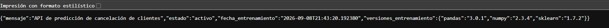
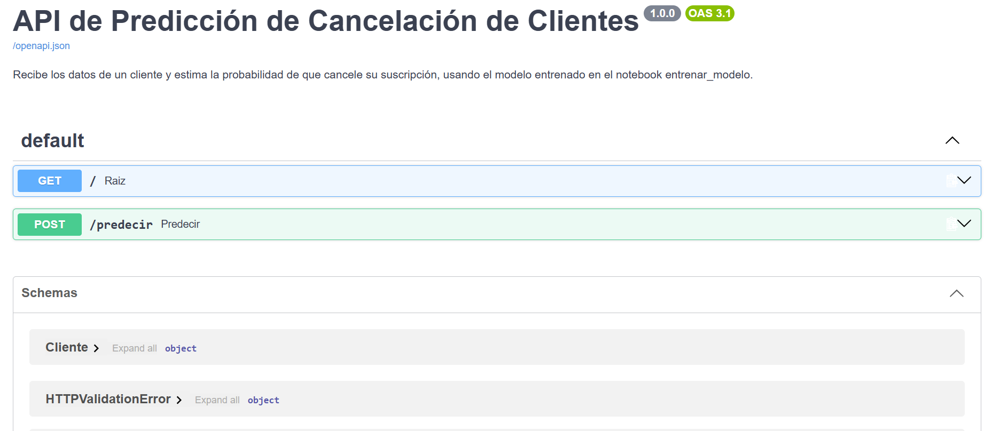
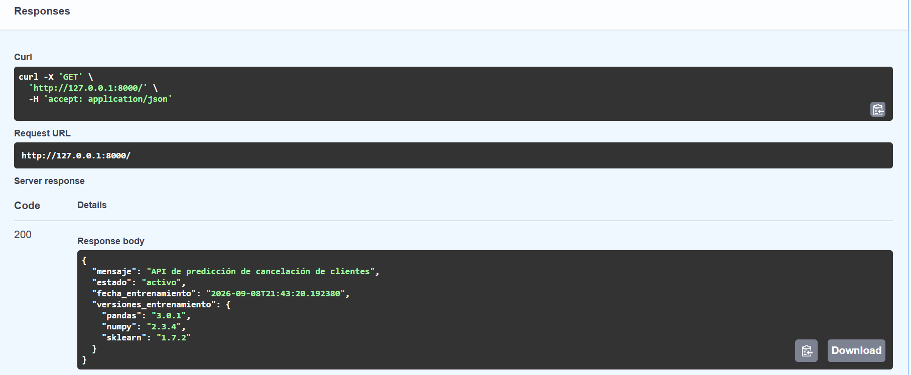
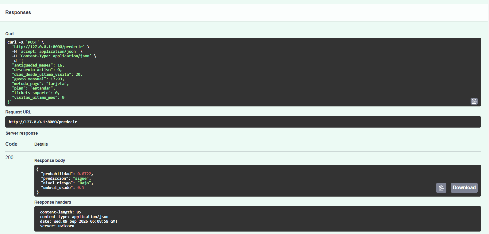
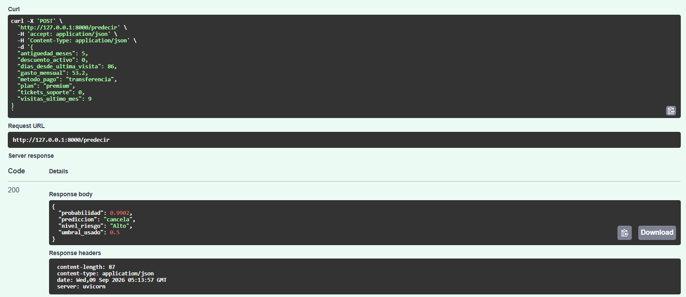
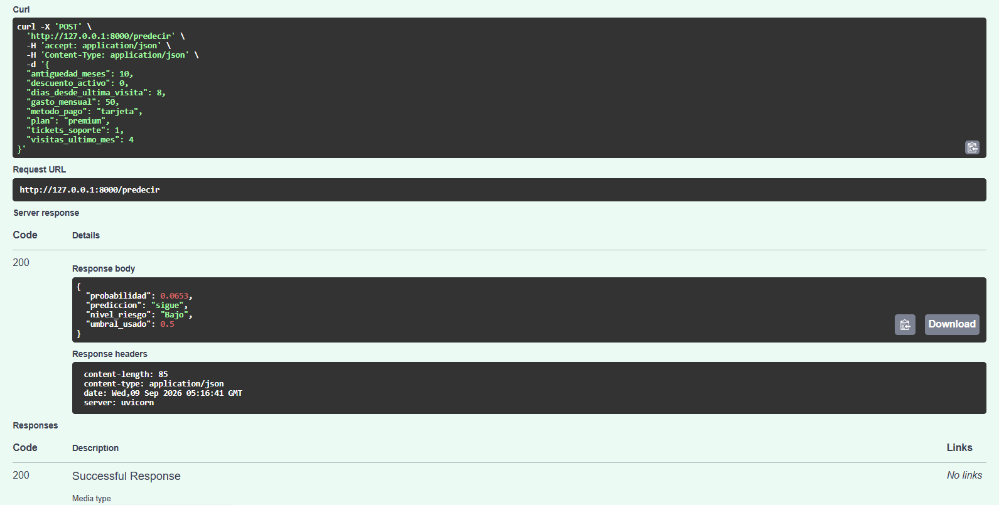
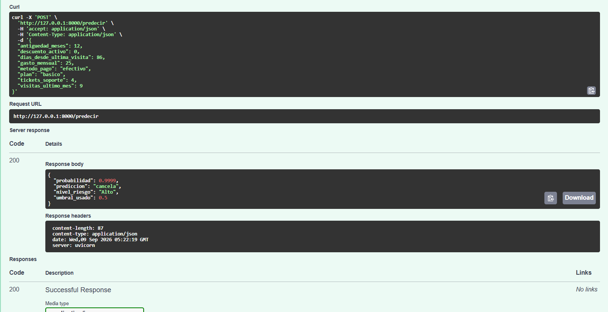
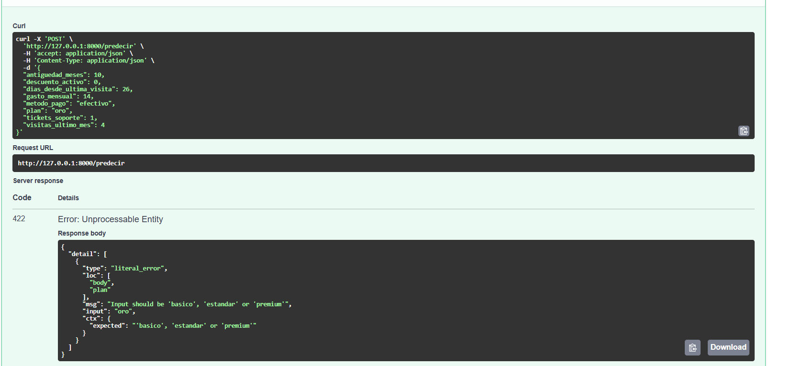

# Despliegue del modelo de cancelación de clientes

Reporte técnico del despliegue del modelo entrenado en `entrenar_modelo.ipynb`:
empaquetado en un bundle, contratos de datos con Pydantic y una API REST con
FastAPI para servir predicciones.


## 1. Estructura del proyecto

```
proyecto/
├── entrenar_modelo.ipynb     # notebook de entrenamiento (Partes 1 y 2 completadas acá)
├── clientes.csv              # dataset de entrenamiento
├── modelo_churn.joblib        # generado al correr la Parte 2 del notebook
├── esquemas.py                 # contratos de datos (Pydantic)
├── main.py                     # API FastAPI
├── requirements.txt
└── README.md                    # este documento
```


## 2. Parte 1 — Construir el bundle

El bundle es un diccionario que junta el modelo entrenado con **todo lo que la
API va a necesitar saber sobre él**, para que `main.py` no tenga que adivinar
nada ni repetir código del notebook:


from datetime import datetime

bundle = {
    "modelo": modelo,
    "columnas": COLUMNAS,
    "columnas_numericas": COLUMNAS_NUMERICAS,
    "columnas_categoricas": COLUMNAS_CATEGORICAS,
    "valores_permitidos": {
        "plan": sorted(X_entrena["plan"].unique().tolist()),
        "metodo_pago": sorted(X_entrena["metodo_pago"].unique().tolist()),
    },
    "umbral": 0.5,
    "metricas": {
        "exactitud": float(exactitud),
        "precision": float(precision),
        "sensibilidad": float(sensibilidad),
        "f1": float(f1),
        "auc": float(auc),
    },
    "fecha_entrenamiento": datetime.now().isoformat(),
    "filas_entrenamiento": len(X_entrena),
    "versiones": {
        "pandas": pd.__version__,
        "numpy": np.__version__,
        "sklearn": sklearn.__version__,
    },
}
```

Decisiones a destacar:

- **`modelo` es el `Pipeline` completo**, no solo el clasificador. Como el
  preprocesamiento (escalado + one-hot) vive adentro del pipeline, la API
  puede pasarle un cliente "crudo" (con `plan="premium"` como texto) sin
  reproducir ninguna transformación manual.
- **`valores_permitidos` sale de `X_entrena`**. Con   6.000 clientes y un split estratificado, es prácticamente seguro que las 3   categorías de `plan` y las 3 de `metodo_pago` están representadas en el   conjunto de entrenamiento.
- **Las métricas se convierten a `float` nativo** (`float(exactitud)`, etc.):
  las funciones de `sklearn` devuelven `numpy.float64`, que `joblib` guarda
  sin problema, pero conviene normalizar a tipos nativos de Python para que
  cualquier cosa que después serialice el bundle a JSON no tropiece con tipos
  de numpy.
- **`fecha_entrenamiento` se guarda ya en formato `isoformat()`** (string), no
  como objeto `datetime`, para que el endpoint `GET /` la pueda devolver
  directo sin conversiones extra.

## 3. Parte 2 — Guardado y verificación


# Guardar
joblib.dump(bundle, "modelo_churn.joblib")
print("Bundle guardado en modelo_churn.joblib")

# Recargar y volver a predecir con el mismo cliente_nuevo
bundle_cargado = joblib.load("modelo_churn.joblib")
prob_verificacion = bundle_cargado["modelo"].predict_proba(cliente_nuevo)[0, 1]

print(f"Probabilidad original  : {prob:.6f}")
print(f"Probabilidad recargada : {prob_verificacion:.6f}")
assert abs(prob_verificacion - prob) < 1e-9, "Las probabilidades no coinciden"
print("Coinciden ✅")
```

El `assert` se usa como prueba de que el archivo sirve: si el bundle guardado
no reproduce exactamente la misma probabilidad que el modelo en memoria, algo
se perdió al serializar (y la API, más adelante, tampoco va a funcionar).

## 4. Contratos de datos — `esquemas.py`

`Cliente` define los 8 campos de entrada, con los mismos nombres que
`COLUMNAS_NUMERICAS` + `COLUMNAS_CATEGORICAS` del notebook (el pipeline
selecciona columnas por nombre, así que tienen que coincidir letra por
letra):

| Campo | Tipo | Validación |
|---|---|---|
| `antiguedad_meses` | `int` | `ge=0` |
| `gasto_mensual` | `float` | `ge=0` |
| `visitas_ultimo_mes` | `int` | `ge=0` |
| `dias_desde_ultima_visita` | `int` | `ge=0` |
| `tickets_soporte` | `int` | `ge=0` |
| `descuento_activo` | `int` | `ge=0, le=1` |
| `plan` | `Literal["basico", "estandar", "premium"]` | — |
| `metodo_pago` | `Literal["tarjeta", "transferencia", "efectivo"]` | — |

Un punto que conecta con algo que el propio notebook señala: el
`OneHotEncoder(handle_unknown="ignore")` del pipeline hace que, si llegara un
`plan` desconocido, el modelo **no explote** pero tampoco lo rechace — lo
trata como si todas las categorías fueran cero. Usar `Literal` en `Cliente`
tapa ese hueco *antes* de que el dato llegue al modelo: FastAPI devuelve un
`422 Unprocessable Entity` automáticamente si `plan` o `metodo_pago` no son
uno de los valores válidos, así que en la práctica el `handle_unknown="ignore"`
nunca se llega a activar vía la API.

El `model_config` con `json_schema_extra` define un ejemplo para Swagger — se
usó a propósito el mismo `cliente_nuevo` del notebook, para que el ejemplo que
aparece por defecto en `/docs` sea uno que ya se conoce el resultado.

También se agregó `RespuestaPrediccion`, el contrato de **salida** de
`/predecir` para documentar la respuesta con un `response_model` en FastAPI: Swagger muestra el esquema exacto de lo que devuelve el endpoint. 

## 5. La API — `main.py`

### Carga del modelo (`lifespan`)

```python
@asynccontextmanager
async def lifespan(app: FastAPI):
    try:
        estado["bundle"] = joblib.load(RUTA_BUNDLE)
    except FileNotFoundError as exc:
        raise RuntimeError(...) from exc
    yield
    estado.clear()
```

El bundle se carga **una sola vez**, cuando arranca `uvicorn`, y queda en el
diccionario `estado` durante toda la vida del proceso — no se vuelve a leer
el `.joblib` del disco en cada request. Si el archivo todavía no existe (por
ejemplo, si se corre la API antes que la Parte 2 del notebook), el servidor
falla al arrancar con un mensaje claro en vez de fallar más adelante con un
`KeyError` confuso en el primer request. `RUTA_BUNDLE` se arma con
`Path(__file__).parent`, así que funciona sin importar desde qué carpeta se
lance `uvicorn`.

### `GET /`

Devuelve un mensaje de bienvenida, el estado del servicio, y la fecha de
entrenamiento y versiones que quedaron guardadas en el bundle — útil para
confirmar, sin mirar el código, con qué versión de datos/librerías se entrenó
el modelo que está sirviendo la API en este momento.

### `POST /predecir`

1. Recibe un `Cliente` (ya validado por Pydantic).
2. Lo convierte a un `DataFrame` de una sola fila — el pipeline espera un
   DataFrame, no un dict, para poder aplicar `ColumnTransformer` por nombre
   de columna.
3. Llama a `modelo.predict_proba(...)[0, 1]`, envuelto en un `try/except` que
   traduce cualquier falla del pipeline en un `HTTPException(500, ...)` en
   vez de un stack trace crudo.
4. Compara la probabilidad contra `umbral` (0.5) para decidir `"cancela"` vs
   `"sigue"`, y por separado la clasifica en un nivel de riesgo:

   | Nivel | Rango de probabilidad |
   |---|---|
   | Bajo | `< 0.4` |
   | Medio | `0.4 – 0.6` |
   | Alto | `≥ 0.6` |

   **`umbral` y `nivel_riesgo` son independientes.** El umbral decide la
   predicción binaria; el nivel de riesgo es una lectura más fina pensada
   para priorizar a quién contactar primero — un cliente puede caer en
   `"sigue"` y aun así estar en riesgo `"Medio"`.

## 6. Cómo correrlo

```bash
pip install -r requirements.txt

# 1. Abrí entrenar_modelo.ipynb y corré todas las celdas, incluidas
#    las de la Parte 1 y 2 (esto genera modelo_churn.joblib)

# 2. Desde la carpeta del proyecto:
uvicorn main:app --reload

# 3. Abrí http://127.0.0.1:8000/docs
```

## 7. Capturas de pantalla

- [, : Bundle caragado sin errores]
- [: (/docs) — vista general con los endpoints GET / y POST /predecir]
- [: GET / ejecutado, mostrando fecha_entrenamiento y versiones_entrenamiento]
- [: POST /predecir con los datos del `dataset clientes.csv` (linea 1) — cliente que no canceló, se valida que funciona]
- [: POST /predecir con los datos del `dataset clientes.csv` (linea 15) — cliente que  canceló, se valida que funciona]
- [: POST /predecir con los datos de `cliente_nuevo` (plan premium, paga con tarjeta) — cliente de menor riesgo, predice bien que no cancela]
- [: POST /predecir con los datos de `cliente_nuevo` (plan básico, paga en efectivo, varios días desde última visita) — cliente de mayor riesgo, predice bien que ccancela]
- [: POST /predecir con un dato inválido ejemplo `plan` Oro, mostrando el 422 que genera la validación de Pydantic]


